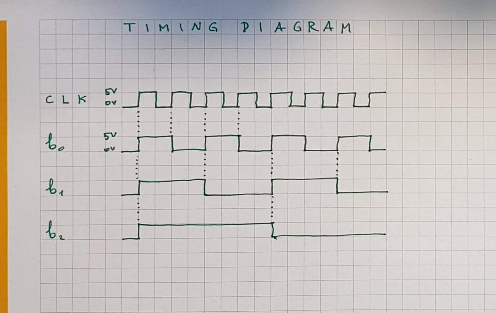

# CPE 1040 - Spring 2020

## Assignment 6: Flip-flops

Author: Ivo Georgiev, PhD  
Last updated: 2020-03-15   
Code: b49e4fe11d5571df7bc8ee98a0d719db43a8cedc      

This is assignment 6 for the Spring 2020 installment of the CPE 1040 - Intro to Computer Engineering course at MSU Denver.

**Conversion to Take-Home TODOs:**
1. Turn into a lesson-n-assignment:
   1. Divide into read-try-do sections.
   2. Structure lesson and assignment in parallel with mininal change. 
   3. Interleave the exposure and exploration parts. It should be a single progression.
   4. Reference videos and materials _inline_.
   5. Supplement with _short_ original videos.
   6. Overview should state this format and identify prerequisites. (Link with previous.)
1. No workstation, so no buttons or logic output LEDs. Adapt to use the micro:bit button and LEDs.
2. Include video and/or guide for using handheld multimeters.
3. Include lab-kit contents, user guide, and safety of operation.
4. Add note that 74LS00 chips require 5V.
5. Square wave gen in micro:bit:
   1. In separate `forever` loop. A note on _threads and fibers_. Link to [Reactive](https://makecode.microbit.org/device/reactive).
   2. Test the following functions (_Use in conjunction to test w/o oscilloscope._): 
      1. [`analogSetPeriod`](https://makecode.microbit.org/reference/pins/analog-set-period),
      2. [`onPulsed`](https://makecode.microbit.org/reference/pins/on-pulsed),
      3. [`analogSetPitchPin`](https://makecode.microbit.org/reference/pins/analog-set-pitch-pin),
      4. [`analogPitch`](https://makecode.microbit.org/reference/pins/analog-pitch)
      5. [`pulseDuration`](https://makecode.microbit.org/reference/pins/pulse-duration)
   3. Discover and show all the pin simulation functions of the MakeCode environment.
6. ~Convert previously bonus parts to required.~
7. ~Remove challenge to build a flip-flop.~
8. Note that at most 4 lines can be voltage converted. _The /CLR signal is active-low. If 3.3V is enough to keep it in the high state, it can be connected directly._
9. Explain both voltage converter devices.
10. Build the final circuit, check the constraints with translation pins, and update the "front-page" picture.
11. Remove lab oscilloscope parts and maybe explore the [microbit as an oscilloscope project](http://www.elektronik-labor.de/Microbit/Microbit9.html).

### Overview

This assignment introduces _flip-flops_, how they are built, and what circuits can be built from them. Flip-flops (aka _latches_) are among the simplest circuits that can have two different stable _states_ and their principle of operation lies at the basis of computer memory. The goal of this assignment is to create a _modulus counter_ out of _D-type_ flip-flops, drive it from the micro:bit, and read off the 3-bit binary output with the micro:bit. The final build is shown in the image below. 


_Refer to the [requirements](requirements.md) for this assignment. Filling out the [README](README.md) for this repository is part of the assignment. Treat the README as your **lab notebook**. Refer to the [criteria](criteria.md) for submitted assignments!_

#### Preparation

Before plunging into the assignment, let us prepare ourselves by briefly 

#### Requirements

##### 1. Capacitors

Capacitors are important cicruit elements which hold charge. They are represented as two plates with terminals as shown below:
```
    |
---------
---------   A capacitor has two plates across which there is voltage
    |
```
When voltage is applied to the two terminals, charge accumulates until the voltage between the plates (and terminals) of the capacitor equals the applied voltage. If the voltage is removed and there is a circuit connection between the two terminals, current flows from the terminal with the higher voltage toward the terminal with the lower voltage. Eventually, the current dissipates the accumulated charge and the voltage across the plates drops to zero.

Capacitors are a key component of a [flip-flop](https://www.youtube.com/watch?v=IykOrxVcdyg), so the purpose of this section is to give you intuition about their function it its operation.

1. This part lets you see how a capacitor operates. Build the circuit below:


2. Make sure the capacitor starts out _discharged_. _Hint: Connect the two terminals with a resistor._
3. Attach the multimeter, in voltage mode, at the point V<sub>C</sub> or, in current mode, anywhere in the circuit. Apply the circuit voltage source and watch the reading of the multimeter. As the capacitor charges, current will flow and there will be voltage drop across the resistor. When the capacitor reaches its charge capacity, that is, it _charges_, the current will diminish to zero amperes and the voltage at V<sub>C</sub> will climb back to 5V. _Why?_
4. Now take the capacitor out of the circuit, making sure you don't touch the terminals to each other or connect them through a circuit, and plug it into the second circuit below:


5. Watch the LED light up then quickly fade to dark as the capacitor discharges through the circuit.

##### 2. D-type flip-flop

###### Notes on reading the datasheet

1. Our lab has 74LS74 chips, each containing two D-type positive-edge triggered flip-flops.
2. Only the first page of the [datasheet](http://www.ti.com/lit/ds/symlink/sn74ls74a.pdf) is necessary for this project.
3. Our chip has the _form factor_ and _pinout_ at the top right.
4. The _logic symbol_ at the bottom left shows _inputs on the left_ and _outputs on the right_.
5. The operation is layed out in two ways:
   1. The _description_ does it in words. _In summary, the device transfers its input value at D onto its output Q (and inverted output /Q) only upon a positive edge of the "clock" input._
   2. The _function table_ does it symbolically, but is equivalent to the description. _Note: An X represents a "don't care" input, that is, it doesn't matter what its value is; and an upward arrow means a positive edge. See the diagram below for what a positive edge is._
   ```
   5V       |------|      |------
            |      |      |          this is a "square" wave, which is typical of clock (CLK) signals in electronics
   0V ------|      |------|
   
         ^  this is the positive edge, where the voltage rises from logic LOW (0V) to logic HIGH (5V)
   ```

###### Requirements

1. Place a 74LS74 chip in the middle of a breadboard tile (across the center groove). _Note: The chip has a **notch** or **dent**, which has to be pointing **UP**. Otherwise, you will burn both the chip and the tile underneath._
2. Using the pinout of the chip, connect the chip to V<sub>CC</sub> of 5V and GND of 0V.
3. Use the _function generator_ on the workstation to generate the clock signal for the _top_ flip-flop:
   1. Set the wave form to **SQUARE**. _Make sure the high voltage is 5V._
   2. Choose a very low frequency, say a _fraction of a Hz_. _You will want to vary the frequency with the nob at the top left of the workstation._
   3. Connect the **OUT** column from the generator to your **1CLK** input.
4. Connect a TTL logic switch to the **1D** input.
5. Connect the **1Q** and **1/Q** to two TTL logic LEDs (top right). _Note: The bar on top of a symbol, in this case Q, means NOT. That is, whatever the value of Q is (logic high or logic low), /Q will be the opposite. We are using the **forward slash** because markdown cannot represent a bar._
6. Connect **1/CLR** and **1/PRE** to logic high (5V).
7. With a very low clock frequency, toggle the input switch and watch the output LEDs. At low frequency, you will see a lag.
8. Increase the frequency to see that the lag stops being dinstinguishable.
9. Draw the circuit and include an image of the drawing in your README. _Use the **images** directory. See the [template](submission-template.md) or this file to see how to write the markdown for embedding images._
10. Take a picture of your setup and include it in your README.
11. With the switch at logic low, connect Channel 1 of the oscilloscope to your clock signal, and Channel 2 to your Q output. Set the _trigger_ on a _rising edge_ of Channel 2. Adjust the channels so you can see the clock on top of the Q output. (_We'll demo this in class._) Set the mode to **RUN** (not **AUTO**), then hit **SINGLE** and turn the input switch (D) on. You should be able to capture the Q signal rising from low to high, closely aligned _after_ a clock positive edge.
12. Take a picture of the oscilloscope window and include in your README.

##### 3. 3-bit modulus counter


_Note: An **active low** signal like **1/Q** and **1/CLR** signal can be represented in a diagram with its non-negated name and a circle ° at the terminal, as it is done in this diagram. The circle comes from the shortened representation of an **inverter**._

1. Reason and explain how this circuit works:
   1. On a sheet of paper with a checkerboard pattern, pick 4 lines at 4 rows from each other. Label at the left, from top to bottom, **CLK**, **1Q**, **2Q**, **3Q**.
   2. The lines are 0V and one row up from each line is 5V. Label them.
   3. Now trace the **CLK** square wave for 8 periods, up-down-up-down-...
   4. Study the first (leftmost, closest to the clock) flip-flop and calculate what the **1Q** output (aka **b<sub>0</sub>**) will trace, if driven by the clock you just traced. _Hint: Remember that the Q output changes to the value of D **only** on a positive edge of the clock signal._
   5. Do the same for the second, and then the third flip-flop. _Note: Notice that the clock input of a flip-flop other than the first one comes from the output Q of the previous one._
   6. Take a picture of your resulting diagram and embed it in a description of the circuit operation in your README.



2. Using two 74LS74 chips, build a 3-bit modulus counter from 3 of the D-type flip-flops. _Don't forget to place the chips with notches pointing up, and to power and ground each chip._
3. Use the same clock signal from the previous [section](#requirements-1).
4. Disconnect the **1Q** input from the input switch. Instead, connect the 3 _clear_ signals **1/CLR**, **2/CLR**, and **3/CLR** together to the same switch and turn the switch on (red light). We'll call this the _clear switch_.
5. Connect the outputs **3Q**, **2Q**, and **1Q** to three logic output LEDs, so they line up _in this order_ (on the horizontal line of LEDs at the top right). _Note: These represent a **b<sub>2</sub>b<sub>1</sub>b<sub>0</sub>** pattern in the drawing above, representing a 3-bit binary integer._
6. Toggle the clear switch off and on quickly. This zeroes out the circtuit and then it starts counting from 0 to 7 _in binary_. Remember the patterns for binary counting: `000 - 001 - 010 - 011 - 100 - 101 - 110 - 111`. When an LED is lit up, it represents a 1, and when it is dark, a 0. Verify that your 3-bit counter is working properly. _Note: The fact that the counter returns to `000` after reaching `111`, always cycling through the numbers in the same order, gives it the name "modulus". In this case, this is modulus-8 (aka modulo-8 or mod-8). A modulus counter never reaches the number in its name. Remember 0-based counting!_
7. Record a video of your setup and the output LEDs counting and link to it in your README. _Note: Tune the frequency so as to minimize the video length but the individual numbers can still be seen._

   **TODO:** Expand the following to establish awareness of control signals.
   
8. Connect the clock and the 3 bit outputs to the 4 channels of the oscilloscope and record the counting in a video or image. Link to or embed in your README. _What signlal should you toggle on to see what your timing diagram shows?_

##### 4. Logic level converter

**TODO:** Show both converters as they got confused.

The micro:bit works at 3.3V while the workstation works at 5V. This means that a _logic high_ in the two circuits is actually at different voltages. Logic level voltages are a [big deal](https://www.allaboutcircuits.com/textbook/digital/chpt-3/logic-signal-voltage-levels/), but we only need to say here that the two circuits should not be connected directly to each other (as we did in the last assignment :D). Instead, we use a [logic level converter circuit](https://learn.sparkfun.com/tutorials/bi-directional-logic-level-converter-hookup-guide) to bridge the two circuits. _Notice the diode pointing from low voltage to high voltage!_

1. Hook up one of the converters and power it properly as shown in the hookup guide. You need to power the two sides with the two different voltages and two _different grounds_! _Warning: Please, do not confuse the **low voltage 3.3V** with the **high voltage 5V** or you will damage the converter._
2. Hook up a workstation TTL switch on the _high side_ and, while togling it, measure the voltage on the _low side_ with the multimeter.
3. Now connect the _low side_ pin to a digital input pin of the micro:bit. Drive an external LED with another pin, as in [Assigment 5](https://github.com/ivogeorg/asst-cpe-transistors/blob/master/requirements.md#requirements-1). Record a very short video to show your circuit operating and link to it in your README.
4. Hook up a ditigal output pin from the micro:bit to the _low side_ and measure the voltage on the _high side_ with the multimeter.
5. Now hook up the corresponding _high side_ pin to one TTL output LED as in the [previous section](#3-3-bit-modulus-counter). Record a very short video to show your circuit operating and link to it in your README.

##### 5. Drive counter with micro:bit

1. Write a program to drive the counter master clock signal **1CLK** with a programmable frequency. Here is a simple program to get you started:
```TypeScript
basic.forever(function () {
    pins.digitalWritePin(DigitalPin.P12, 1)  // positive edge
    basic.pause(200)
    pins.digitalWritePin(DigitalPin.P12, 0)  // negative edge
    basic.pause(200)
})
```
2. Hook up pin 12 _through the logic level converter_ (from **3.3V** to **5V**) to the **1CLK** pin of your counter on the workstation breadboard. 
3. Commit to your repository as file `clk.js`.
4. Record a video of the micro:bit driving the counter and the counter counting correctly on the TTL output LEDs. Link in your README. _Remember the clear signal that starts the counter correctly at `000`._
5. Modify the program to double the frequency (halve the pause time) on the press of button A and to halve the frequency (double the pause time) on the press of button B. _Hint: Look at your previous programs. You should have all the code._
6. Commit to your repository as file `clk-variable.js`.
7. Record a video of the micro:bit driving the counter at different frequencies and the counter counting correctly on the TTL output LEDs. Link in your README. _Remember the clear signal that starts the counter correctly at `000`._

##### 6. Display counter output on micro:bit LEDs

1. Use 3 digital read pins to read off the binary counter number and display on the micro:bit LED matrix:
   1. Hook up the three **Q** outputs _through the logic level converter_ (from **5V** to **3.3V**) to 3 chosen micro:bit _digital read_ pins. _Note: First, disconnect them from the TTL output LEDs._
   2. Remember that the counter updates at every _positive edge_ of the clock. So, your program should check the values of the 3 digital read bits _between_ the clock pin writing 1 and writing 0:
   ```TypeScript
   basic.forever(function () {
       pins.digitalWritePin(DigitalPin.P12, 1)
       basic.pause(200)   // This will have to be reduced, and will mess the variable frequency
       let b0 = pins.digitalReadPin(DigitalPin.P0)
       let b1 = pins.digitalReadPin(DigitalPin.P1)
       let b2 = pins.digitalReadPin(DigitalPin.P2)
       // more code...
       pins.digitalWritePin(DigitalPin.P12, 0)
       basic.pause(200)
   })
   ```
   3. Remember what a _positional numeral system_ is and convert the bit pattern **b<sub>2</sub>b<sub>1</sub>b<sub>0</sub>** from binary to decimal. _Hint: Sum of powers._
   4. Show this number on the micro:bit LED matrix.
2. Commit to your repository as file `clk-led.js`.
3. Record a video showing the micro:bit driving the counter and showing the count on the LEDs, and link to it in your README. _Note: At this point, your circuit should look more or less like the picture at the top of the assignment._

   **TODO:** Expand the following to systematically explore issues of timing.

4. The extra computation that we are doing after the first `basic.pause(200)` in the code above is definitely going to _skew_ the clock signal. That is, the time it spends at logic high is going to be longer than the time it spends at logic low. Try to ameliorate this effect, by either experimenting with shorter pause times or by a more sophisticated method. As an extra bonus, try to devise such a solution that would work even when the frequency of the clock is modified by pressing the A and B buttons from the [previous section](#5-drive-counter-with-microbit). 
5. Commit to your repository as file `clk-led-no-skew.js`.
6. Record a video to show the full proper operation with minimal or no clock skew, and link in your README within an explanation of your method.

##### 7. Flip-flop control signals

**TODO:** Signals are clock out, 3-bit in, and ctl. Volgate converter has only 4 lines :(

1. Use a second converter to drive the control signal **x/CLR** with a micro:bit digital write pin.
2. Modify your program to clear the counter on a simultaneous press of both A and B buttons. 
3. Commit to your repository as file `clk-led-clr.js'.
4. Record a video demonstrating the full operation of your circuit, including the initial clear, and link in the README.

##### 8. Modulo-5 counter

**TODO:** Introduce combinational circuits!

1. Build a [_combinational circuit_](https://www.electronics-tutorials.ws/combination/comb_1.html) out of [_logic gate_](https://en.wikipedia.org/wiki/Logic_gate) [ICs](https://en.wikipedia.org/wiki/List_of_7400-series_integrated_circuits) (AND, OR, NOT, etc.) to drive one of the control signals to change your circuit from a mod-8 counter to a **mod-5 counter**:
   1. Design the signal necessary to force the counter to cycle back to `000` before it reaches `101`.
   2. Ask staff for the logic gates you need. _We have a variety of [74LS00 chips](https://en.wikipedia.org/wiki/List_of_7400-series_integrated_circuits)._
   3. Build the circuit. _Note: Don't forget to power and ground the ICs._
2. Record a video showing mod-5 counting and link in README.
3. Now disconnect the combinatorial circuit and modify your program to do the same thing with the clear control signal that comes from the micro:bit.
4. Commit to your repository as file `mod-5-clr.js`.
5. Record a video showing mod-5 counter without external logic gates, and link to README with a brief explanation of your code.

## Resources

### micro:bit 

1. [micro:bit lessons](https://makecode.microbit.org/lessons).
2. [micro:bit ideas](https://microbit.org/ideas/).
3. A list of some more [advanced projects](https://www.itpro.co.uk/desktop-hardware/26289/13-top-bbc-micro-bit-projects).
4. The [projects](https://github.com/carlosperate/awesome-microbit#%EF%B8%8F-projects) at the [awesome micro:bit list](https://github.com/carlosperate/awesome-microbit).
5. micro:bit [technical documentation](https://tech.microbit.org/).
6. micro:bit [reference](https://makecode.microbit.org/reference/), and [pins](https://makecode.microbit.org/reference/pins/servo-set-pulse), specifically.

### Transistors
1. Video of [transistor operation](https://www.youtube.com/watch?v=7ukDKVHnac4)
2. Video of [PN diode operation](https://www.youtube.com/watch?v=-SSkjWuUri4)
3. Video of [NPN and PNP transistor operation](https://www.youtube.com/watch?v=R0Uy4EL4xWs)
4. Video of [NPN vs. PNP Transistors as Common-Emitter Switches](https://www.youtube.com/watch?v=kNVaIqmKUoI)
5. Video of [semiconductor operation](https://www.youtube.com/watch?v=33vbFFFn04k) by Ben Eater.
6. Video of [transistor operation](https://www.youtube.com/watch?v=DXvAlwMAxiA) by Ben Eater.
7. Video of [MOSFET operation](https://www.youtube.com/watch?v=stM8dgcY1CA)

#### Transistor datasheets

1. NPN transistor [2N3904 datasheet](https://www.sparkfun.com/datasheets/Components/2N3904.pdf)
2. PNP Transistor [2N3906 datasheet](https://www.sparkfun.com/datasheets/Components/2N3906.pdf)

### Flip-flops
1. Very in-depth yet accessible Wikipedia article on [flip-flops](https://en.wikipedia.org/wiki/Flip-flop_(electronics))
2. Video of [flip-flop circuit build & operation](https://www.youtube.com/watch?v=IykOrxVcdyg)

#### Flip-flop datasheets

1. D-type flip-flop [74LS74](http://www.ti.com/lit/ds/symlink/sn74ls74a.pdf)

#### Capacitors

1. A short lesson and video on [how a capacitor works](https://www.build-electronic-circuits.com/how-does-a-capacitor-work/)

### Sensors

1. SparkFun soil moisture sensor [hookup guide](https://learn.sparkfun.com/tutorials/soil-moisture-sensor-hookup-guide). _Note: The guide is for Arduino, not micro:bit, but that does not affect the operation of the sensor See the intro item in the [soil sensor section above](#soil-sensor)._

### Logic level converter

1. [Bi-directional logic level converter](https://www.sparkfun.com/products/12009) between 3.3V and 5V.
2. Converter [schematic](https://cdn.sparkfun.com/datasheets/BreakoutBoards/Logic_Level_Bidirectional.pdf), N-channel MOSFET [datasheet](https://cdn.sparkfun.com/datasheets/BreakoutBoards/BSS138.pdf), with [operation explanation](https://cdn.sparkfun.com/tutorialimages/BD-LogicLevelConverter/an97055.pdf), and **most importantly** [hookup guide](https://learn.sparkfun.com/tutorials/bi-directional-logic-level-converter-hookup-guide).

### Oscilloscopes

1. Video [Oscilloscopes Made Easy Part 1](https://www.youtube.com/watch?v=uU3FhH7_MWo&t=1s)
2. Video [EEVblog #279 - How not to blow up your oscilloscope](https://www.youtube.com/watch?v=xaELqAo4kkQ)
3. Video [Oscilloscopes Made Easy Part 2](https://www.youtube.com/watch?v=5VyotIVwRiA)
4. Video [How to use an oscilloscope (SparkFun)](https://www.youtube.com/watch?v=u4zyptPLlJI)
5. Video [Oscilloscope tutorial](https://www.youtube.com/watch?v=CzY2abWCVTY)
6. Video [Rigol 1000s Series docs (manuals, datasheets, videos)](https://www.rigolna.com/products/digital-oscilloscopes/1000z/)

### Github

1. Github Tutorial for Beginners ([webpage](https://product.hubspot.com/blog/git-and-github-tutorial-for-beginners)).
2. Github Basics for Mac and Windows ([video](https://www.youtube.com/watch?v=0fKg7e37bQE)).
3. git & Github Crash Course for Beginners ([video](https://www.youtube.com/watch?v=SWYqp7iY_Tc)).
4. Introduction to Github for Beginners ([video](https://www.youtube.com/watch?v=fQLK8Ib_SKk)).
5. About `git` ([webpage](https://git-scm.com/about)).
6. `git` [documentation](https://git-scm.com/doc) (webpage, book, videos, reference manual).
7. [Github markdown cheat sheet](https://github.com/adam-p/markdown-here/wiki/Markdown-Cheatsheet).

### JavaScript

1. Technically, the language which is used side-by-side with Blocks in the Makecode ronment is a subset of [TypeScript](https://makecode.com/language), which itself is a superset of JavaScript (technically, [ECMAScript](https://www.ecma-international.org/ecma-262/10.0/index.html#Title)), with some JS features not implemented in Makecode.
2. The limited [JavaScript mini-tutorial](https://makecode.microbit.org/javascript) in Makecode.
3. Official [TypeScript documentation](https://www.typescriptlang.org/docs/home.html):
   1. TypeScript in 5 min [tutorial](https://www.typescriptlang.org/docs/handbook/typescript-in-5-minutes.html). _Note: You will need to [download](https://www.typescriptlang.org/index.html#download-links) and install an integrated development environment (IDE). The two that I recommend are Visual Studio Code from Microsoft and WebStorm from JetBrains._
   2. The full documentation and reference is under _Handbook_. Bear in mind that you are drinking from the hose. Don't be surprised if not everything is presented in a strictly incremental manner.
4. In-browser TypeScript [playground](https://www.typescriptlang.org/play/index.html). Note that micro:bit specific code will not run, but you can still play. _Start making the distinction between a generic multi-purpose programming language (TypeScript) and functionality (packages, libraries, objects, etc.) that is specific to a particular device (micro:bit), though written in the same programming language._
5. A pretty good and very palatable JS tutorial with in-browser coding, by [Codecademy](https://www.codecademy.com/learn/introduction-to-javascript).
6. Extensive and detailed [JS tutorial](https://javascript.info/), with some advanced material thrown in. **I like this one!**
7. The most authoritative JS resource on the Web, including tutorials and reference, by [Mozilla](https://developer.mozilla.org/en-US/docs/Web/JavaScript).
